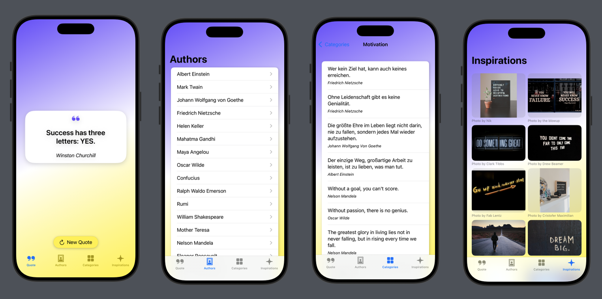

# Quotely

**Quotely** is a SwiftUI app that fetches and displays quotes from various APIs in a user-friendly way. You can explore quotes by authors, categories, and inspirations, keeping your daily motivation at hand. ✨

## Features

- ✅ Display random quotes  
- ✅ Browse quotes by **authors**  
- ✅ Browse quotes by **categories**  
- ✅ View inspirational images from **Unsplash API**  
- ✅ Clear overview of all quotes and categories  
- ✅ Intuitive navigation with **NavigationStack** and **NavigationLink**  
- ✅ Error handling and loading states for smooth UX  
- ✅ Support for APIs that require authentication (like Unsplash)

## Technologies

- SwiftUI for user interface  
- **NetworkService** for generic API requests and HTTP error handling  
- JSON & Codable to decode API responses  
- URLSession & async/await for parallel API requests  
- NavigationStack & NavigationLink for navigation  
- @State for state management  
- Lists, LazyVGrid, buttons, and forms for user interaction  
- Error handling with custom error types (e.g., `QuoteError`)  

## How to Run

1. Click the green **"Code"** button on this repository and select **"Open with Xcode"** (if available), or download the ZIP and open the project manually.  
2. Alternatively, open the `.xcodeproj` or `.xcworkspace` file directly in **Xcode**.  
3. Click the **Run** ▶️ button in the top toolbar to build and launch the app in the iOS Simulator or on a physical device.  
4. Use the app to browse quotes, explore authors and categories, and view inspirational images.

---

📝 Disclaimer

This project was developed as part of my training. The source code, structure, and documentation are my own work.

© 2025 Jeff Braun. All rights reserved. Licensed under the [MIT License](./LICENSE).
